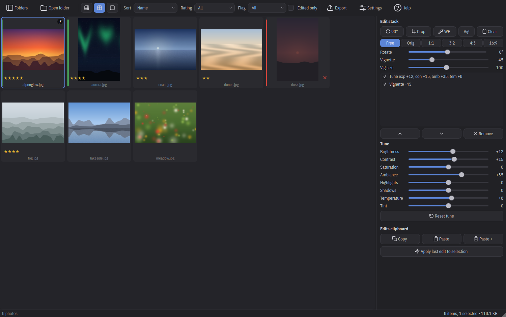
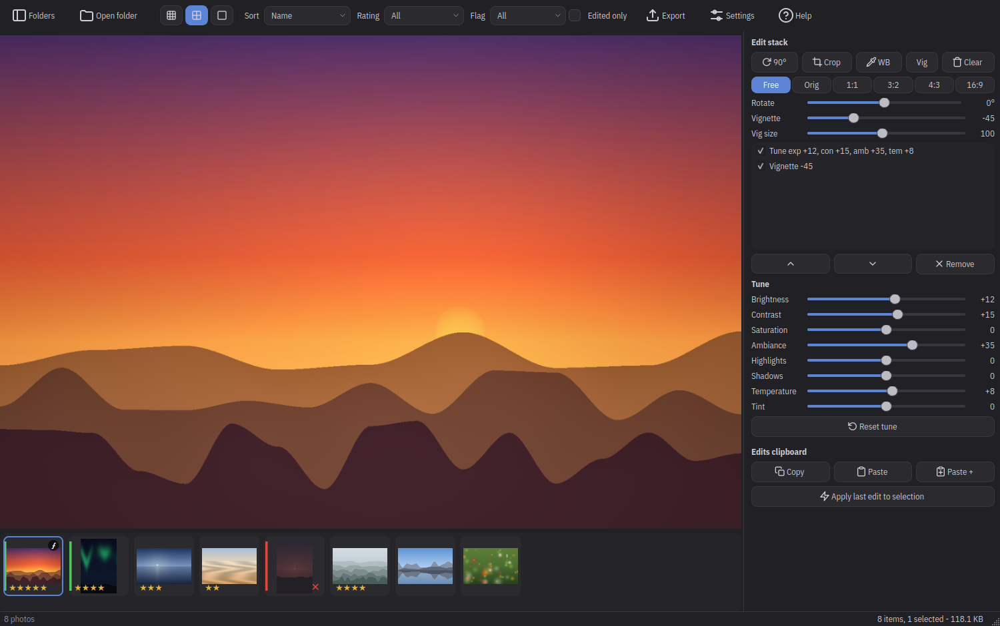
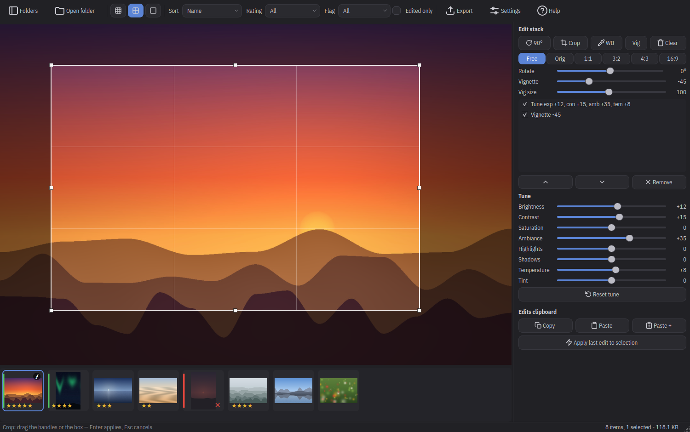

<p align="center">
  
</p>
<h1 align="center">photoflow</h1>
<p align="center">
  Fast photo browsing, culling and non-destructive editing for JPEG, PNG and camera RAW.
</p>
<p align="center">
  <a href="https://github.com/franchg/photoflow/releases/latest/download/photoflow-linux-x64.tar.gz"></a>
  <a href="https://github.com/franchg/photoflow/releases/latest/download/photoflow-windows-x64.zip"></a>
  <a href="https://github.com/franchg/photoflow/releases/latest/download/photoflow-macos-arm64.zip"></a>
</p>



photoflow is the step between a full memory card and the photos you keep.
You point it at a folder, it shows the thumbnails right away, and from
there you flip through your shots, mark the keepers, adjust them with
edits that never touch the original files, and export the result.

## What it is, and what it isn't

photoflow is built for going through a folder of photos quickly. Browsing
feels instant even on large folders, edits preview in real time, and
everything can be done from the keyboard.

It is not a photo manager, and it does not try to replace Lightroom. It
works on one folder at a time, so there is no library of your whole disk,
no albums, no face recognition, no cloud.

A few limitations you should know about before starting:

- It reads JPEG, PNG and the common camera RAW formats (DNG and the
  Canon, Nikon, Sony, Fujifilm, Olympus, Panasonic, Pentax families).
  There is no support for HEIC, WebP, TIFF or video.
- RAW files browse through the JPEG preview the camera embeds, the same
  image you saw on the camera display, so flipping through them is as
  fast as JPEG. Zooming in and exporting use the full sensor resolution,
  developed with the camera's settings. You can cull, edit and export
  them as JPEG, but this is not a RAW developer: there is no recovering
  blown highlights or pushing exposure on the sensor data.
- Edits are global, they apply to the whole image. There are no local
  adjustments, no healing brush, no manual curves.
- Ratings, flags and edits are stored in photoflow's own catalog, not
  inside your files. They survive restarts, but they do not travel with
  files you copy elsewhere, and if you rename or move a file with another
  tool, its edits get disconnected. Settings has a cleanup for those
  cases.
- Photos tagged with a color profile (Adobe RGB cameras, Display P3
  phones) are read correctly, and every export is standard sRGB. Monitor
  calibration is left to the operating system.
- The macOS build runs on Apple Silicon only and is unsigned, so the
  first launch needs a one-time approval, described below. On Windows,
  making photoflow the default viewer is one "Open with → Always" click,
  since Windows insists on asking you. Opening a second image from the
  file manager starts a second window.

## Install

### The easy way: download it

The badges at the top of this page always point at the latest build for
each platform, and every version is on the
[releases page](https://github.com/franchg/photoflow/releases).
Everything is bundled, there is nothing else to install.

#### Linux (x86-64)

```sh
tar -xzf photoflow-linux-x64.tar.gz
./photoflow
```

It is a single binary with everything inside, and it works on any
reasonably recent distribution. On the first launch photoflow registers
itself in your app launcher, with its icon, and if you later move the
binary somewhere else the entry follows it. To make it the system default
viewer for JPEG and PNG, open Settings and use File associations.

#### Windows (x86-64)

Unzip `photoflow-windows-x64.zip`, open the `photoflow` folder and run
`photoflow.exe`.

The build is unsigned, so SmartScreen may complain on the first run:
click "More info", then "Run anyway", and it will not ask again. On that
first run photoflow also registers itself with Windows, so to open your
images with it by default you right-click an image, choose "Open with",
pick photoflow from the list and tick "Always". It appears under
Settings → Default apps too, and if you ever move the photoflow folder,
the registration repairs itself the next time you launch it.

#### macOS (Apple Silicon, all Macs since 2020)

Unzip `photoflow-macos-arm64.zip` and, if you like, drag `photoflow.app`
into Applications.

Here too the build is unsigned, so macOS blocks the first launch. Either
run

```sh
xattr -dr com.apple.quarantine photoflow.app
```

or go through the interface: double-click the app, let macOS block it,
then open System Settings, go to Privacy & Security, scroll down to
"photoflow was blocked" and click Open Anyway. Both are one-time.

### From source

You need [uv](https://docs.astral.sh/uv/) and libjpeg-turbo:

```sh
# Linux (Debian/Ubuntu)
sudo apt install libturbojpeg libjpeg-turbo-progs
# macOS
brew install jpeg-turbo
# Windows: install the official libjpeg-turbo -vc-x64.exe from
# https://github.com/libjpeg-turbo/libjpeg-turbo/releases

git clone https://github.com/franchg/photoflow.git
cd photoflow
uv sync
uv run python app.py [folder | image]
```

A folder argument opens it in the grid, an image argument opens its
folder with that image fullscreen, which is exactly what double-clicking
an image in your file manager does once photoflow is the default viewer.

## User guide

### Browse

Open a folder with Ctrl+O, with the toolbar button, or from the Folders
tree on the left. Thumbnails appear immediately and sharpen as the full
decodes arrive, and since everything is cached, the second visit to a
folder is instant. From the toolbar you can change the thumbnail size and
sort by name or capture date, and Ctrl+R re-scans the folder when its
contents changed on disk.

### Cull

Culling works best from the keyboard: 0–5 rates the selected photo, P
picks it, X rejects it, U removes the flag, and photoflow then moves on
to the next photo by itself, so going through a folder becomes a single
pass of keystrokes. Ratings show as stars on the thumbnail, picks get a
green edge and rejects a red one. With the toolbar
filters you can then narrow the grid to a minimum rating, a flag state,
or edited photos only, so "show me the four-star picks" takes two clicks.
Del moves photos to the system trash, asking for confirmation when more
than one is selected.

### View

Enter or a double-click opens the viewer, and the arrow keys or Space
move through the folder, with a filmstrip below for jumping around. Z
toggles between fit and 100%, the wheel zooms, dragging pans, F goes
fullscreen. If you hold down the right mouse button, photoflow shows the
original with your edits bypassed, so you can compare before and after.

### Edit



All edits are non-destructive. They form a per-photo edit stack stored in
the catalog, your files are never modified, and every edit can be undone
with Ctrl+Z, toggled or removed from the panel at any time, even after a
restart.

- The tune sliders cover Brightness, Contrast, Saturation, Ambiance,
  Highlights, Shadows, Temperature and Tint. Their responses are
  calibrated against Snapseed's, so they stay pleasant across the whole
  range instead of drifting into extreme effects.
- White balance has an eyedropper: press W, click something that should
  be neutral gray, and the temperature and tint are set so that spot
  becomes truly neutral.
- Crop comes with aspect presets (Original, 1:1, 3:2, 4:3, 16:9) that are
  orientation aware, so 3:2 becomes 2:3 on a portrait shot.
- Rotation has the usual 90° button, plus a free-angle slider that works
  like a straighten tool, cropping the photo to the largest clean frame.
- The vignette is placed by clicking where its center should be, then
  shaped with the strength and size sliders. Negative strength darkens
  the edges, positive brightens them.



Edits also move between photos: Ctrl+Shift+C copies the current stack and
Ctrl+Shift+V pastes it onto the whole selection, so you can fix one photo
of a series and give the same look to all the others in one gesture.

### Export

Ctrl+E exports the selection. You choose a destination, a file-name
pattern (with tokens for the original name, the capture date and a
counter), the JPEG quality and an optional resize. PNGs stay PNG,
unedited photos are copied exactly as they are, and EXIF metadata is
preserved. RAW files are copied untouched when they have no edits, so
the keepers keep their originals, and develop to JPEG when they do.

### Settings

Ctrl+, opens the settings: theme (System, Light or Dark) and interface
scale, hidden files, file associations on Linux, and the catalog tools
for relocating it, clearing the thumbnail cache, or cleaning up entries
whose files were moved or deleted.

## Keyboard shortcuts

Press F1 or ? in the app for this list.

| Key | Action |
| --- | --- |
| **Browse** | |
| Ctrl+O | Open folder |
| Ctrl+R / F5 | Re-scan the folder, rebuild its thumbnails |
| Enter / double-click | Open the viewer (Esc goes back) |
| Space / → / ↓ | Next image |
| ← / ↑ | Previous image |
| F / F11 | Fullscreen in and out |
| Del | Move the selection to the system trash |
| **Cull** | |
| 0–5 | Rating, then on to the next photo (press again to clear) |
| P / X / U | Pick / reject / unflag, then on to the next photo |
| **Viewer** | |
| Z / double-click | Fit or 100% (wheel zooms, drag pans) |
| C | Interactive crop (Enter applies, Esc cancels) |
| W | White-balance eyedropper, click a neutral gray |
| V | Vignette, click to place the center |
| Right-click (hold) | Compare with the original |
| **Edit stacks** | |
| Ctrl+Z / Ctrl+Shift+Z | Undo / redo edits, per image |
| Ctrl+Shift+C | Copy the edit stack |
| Ctrl+Shift+V | Paste edits onto the selection (replace) |
| Ctrl+Alt+Shift+V | Paste edits onto the selection (append) |
| Ctrl+L | Apply the last edit to the selection |
| **App** | |
| Ctrl+E | Export… |
| Ctrl+, | Settings… |
| F1 / ? | Keyboard-shortcut help |

## For the curious

The technical story, from the architecture and the render pipeline to how
the tune sliders were calibrated against Snapseed by measurement, lives
in [PLAN.md](PLAN.md). Development needs `uv sync`, and the three test
suites in `tests/` gate every release.

## License

[MIT](LICENSE). The bundled UI font, IBM Plex Sans Condensed, is licensed
under the [SIL Open Font License 1.1](fonts/OFL.txt).
